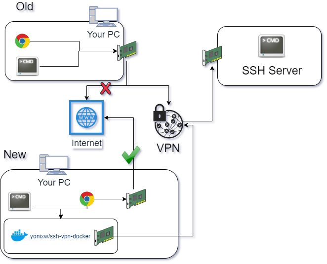

# SSH over OpenVPN in Docker

## Description
Connect to a SSH server (on a VM) using VPN with only 
affecting a specific docker and not your entire PC (letting you to browse the internet at the same time).

It supports tcp port forwarding.



## How to run
1. Clone this repo
2. Configure the docker-compose.yml
    1. Mount your config to `/vpn/config/vpn_config.ovpn`
    2. Change your `ovpn` file to search keys\certs in `/vpn/config`
    3. Mount all needed files to `/vpn/config/` (see example `docker-compose.yml`)
    4. Choose ports in both SSH_PORTS and yaml ports (See next section for info)
3. Start the docker (will not connect to VPN yet)
4. Exec in docker `bash -c "./ssh.sh"`

## Port forwareding
1. Decide on local ports from `<Port_A>` to `<Port_An>`
2. Decide on the ports int the vm from `<Port_B>` to `<Port_Bn>`
    * For example, we want to forwared local port 7777 to port 8888 on the VM

**Important Note:** You cant choose the same port for a pair. So: `<Port_Ai> != <Port_Bi>`
```yaml
 ports:
      - <Port_A>:<Port_A>
      - 7777:7777
    environment: 
      SSH_PORTS: "<Port_A>:<Port_B> <Port_An,Port_Bn> ... 7777:8888" # Local Port -> Port on VM
```

## Get to the point 😡
Configure `docker-compose.yml` and run:
```
docker-compose up -d  --force-recreate vpn && docker-compose exec vpn bash -c "chmod +x ssh.sh && ./ssh.sh"
```
**❌ DO NOT RUN:** 
```
docker-compose run --rm vpn bash -c "chmod +x ssh.sh && ./ssh.sh"
```
Because docker-compose run will not map ports. [See Here](https://github.com/docker/compose/issues/1259#issuecomment-90529907)

## Why so many docker permissions?
The following permissions are a must for VPN inside docker:
* `sysctls: "net.ipv6.conf.all.disable_ipv6=0"`
* `cap_add: NET_ADMIN`
* `devices: /dev/net/tun`

You are free to search the web and report if some can be removed.


